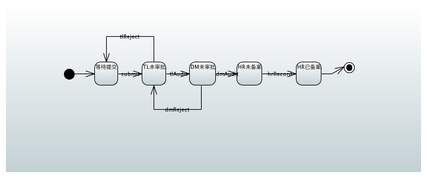

# Spring StateMachine(1) 二级审批流程

以一个简单的二级审批流程（请假）为例，研究一下 StateMachine 的使用。该流程设计如下：



目标：通过 StateMachine 实现该二级审批流程，提供 API 给第三方调用。

## 状态定义

将流程图上的 5 个状态（不包括开始和结束）定义如下：

```
public enum States {
    WAITING_FOR_SUBMIT,             // 等待提交
    WAITING_FOR_TL_APPROVE,         // 等待 TL 审批
    WAITING_FOR_DM_APPROVE,         // 等待 DM 审批
    WAITING_FOR_HR_RECORD,          // 等待 HR 备案
    END,                            // 流程结束
}
```
## 事件

将流程图上的 6 个事件（不括开始和结束）定义如下：

```
public enum Events {
    SUBMIT,   // 提交申请
    TL_AGREE,     // WAITING_FOR_TL_APPROVE 审批
    TL_REJECT,       // WAITING_FOR_TL_APPROVE 驳回
    DM_AGREE,     // 部门经理审批
    DM_REJECT,      // 部门经理驳回
    HR_RECORD,      // WAITING_FOR_HR_RECORD 备案
}
```

## 配置状态机

主要是配置状态、事件和迁移。
```
@Configuration
@EnableStateMachine
public class StateMachineConfig extends EnumStateMachineConfigurerAdapter<States, Events> {

    @Autowired
    private LeaveStateMachinePersist leaveStateMachinePersist;

    @Bean
    public StateMachinePersister<States,Events,String> stateMachinePersist(){
        return new DefaultStateMachinePersister<>(leaveStateMachinePersist);
    }

    @Override
    public void configure(StateMachineStateConfigurer<States, Events> states)
            throws Exception {
        states
            .withStates()
                .initial(States.WAITING_FOR_SUBMIT)
                .states(EnumSet.allOf(States.class));
    }

    @Override
    public void configure(StateMachineTransitionConfigurer<States, Events> transitions)
            throws Exception {
        transitions
            .withExternal()
                .source(States.WAITING_FOR_SUBMIT).target(States.WAITING_FOR_TL_APPROVE)
                .event(Events.SUBMIT)
                .and()
            .withExternal()
                .source(States.WAITING_FOR_TL_APPROVE).target(States.WAITING_FOR_DM_APPROVE)
                .event(Events.TL_AGREE)
                .and()
            .withExternal()
                .source(States.WAITING_FOR_TL_APPROVE).target(States.WAITING_FOR_SUBMIT)
                .event(Events.TL_REJECT)
                .and()
            .withExternal()
                .source(States.WAITING_FOR_DM_APPROVE).target(States.WAITING_FOR_HR_RECORD)
                .event(Events.DM_AGREE)
                .and()
            .withExternal()
                .source(States.WAITING_FOR_DM_APPROVE).target(States.WAITING_FOR_SUBMIT)
                .event(Events.DM_REJECT)
                .and()
            .withExternal()
                .source(States.WAITING_FOR_HR_RECORD).target(States.END)
                .event(Events.HR_RECORD);
    }
```
其中 LeaveStateMachinePersist 是自定义的持久化对象，用于恢复状态机的状态，因为不同的业务对象共用同一个状态机，状态机的状态根据业务 id 来缓存。LeaveStateMachinePersist 目前很简单，仅仅是一个 HashMap 来保存业务 id 和对于的 StateMachineContext：

```
@Component
public class LeaveStateMachinePersist implements StateMachinePersist<States,Events,String> {

    // 用 map 来模拟持久化存储，可替换成数据库
    static Map<String, States> cache = new HashMap<>(16);


    @Override
    public void write(StateMachineContext<States, Events> stateMachineContext, String s) {
        cache.put(s, stateMachineContext.getState());
    }

    @Override
    public StateMachineContext<States, Events> read(String s) {
        return cache.containsKey(s) ?
                new DefaultStateMachineContext<>(cache.get(s),null,null,null,null,"请假流程") :
                new DefaultStateMachineContext<>(States.WAITING_FOR_SUBMIT,null,null,null,null,"请假流程");

    }
}
```

## 控制器

控制器负责对外提供 RESTFul 接口。有 6 个 RequestMapping，分别执行新建请假条、提交、tl审批、dm审批、hr备案和获取状态机当前状态 6 个操作。

```
@RestController
public class StateMachineController {


    @Autowired
    private StateMachinePersister<States, Events, String> persister;

    @Autowired
    private StateMachine<States, Events> stateMachine;


    @RequestMapping("/new")
    @ResponseBody
    public BaseResponse newLeave(@RequestBody LeaveRequest leave){
        BaseResponse result = new BaseResponse();
        stateMachine.start();

        result.message = "新建请假申请成功";
        result.success = true;
        result.data = leave;

        return result;

    }

    @RequestMapping("/apply")
    @ResponseBody
    public BaseResponse apply(@RequestBody JSONObject params){
        String leaveId = params.getAsString("leaveId");

        return sendEvent(Events.SUBMIT,leaveId);

    }

    @RequestMapping("/tlApprove")
    @ResponseBody
    public BaseResponse tlApprove(@RequestBody JSONObject params) {

        String id = params.getAsString("leaveId");
        boolean agree = params.getAsNumber("agree").intValue() != 0;

        return sendEvent(agree ? Events.TL_AGREE : Events.TL_REJECT, id);
    }

    @RequestMapping("/dmApprove")
    @ResponseBody
    public BaseResponse dmApprove(@RequestBody JSONObject params) {

        String id = params.getAsString("leaveId");
        boolean agree = params.getAsNumber("agree").intValue() != 0;

        return sendEvent(agree ? Events.DM_AGREE : Events.DM_REJECT, id);

    }

    @RequestMapping("/hrRecord")
    @ResponseBody
    public BaseResponse hrRecord(@RequestBody JSONObject params) {

        String id = params.getAsString("leaveId");

        return sendEvent(Events.HR_RECORD,id);

    }

    @RequestMapping("/getState")
    @ResponseBody
    public BaseResponse getState(@RequestBody JSONObject params){
        String leaveId = params.getAsString("leaveId");

        BaseResponse result = new BaseResponse();

        try{
            persister.restore(stateMachine,leaveId);

            result.success = true;
            States state = stateMachine.getState().getId();

            result.data = state;

        }catch (Exception e){
            e.printStackTrace();
        }finally {
            stateMachine.stop();
            return result;
        }

    }

    private BaseResponse sendEvent(Events event,String leaveId){
        BaseResponse result = new BaseResponse();

        if(leaveId == null || leaveId.length()==0){
            result.success = false;
            result.message = "leaveId 不能为空";
            return result;
        }

        try {
            // 根据业务 id 获取状态
            persister.restore(stateMachine,leaveId);

            result.success = stateMachine.sendEvent(event);
            // 持久化状态机
            if (result.success) {
                persister.persist(stateMachine, leaveId);
            }
            JSONObject data = new JSONObject();

            result.message = result.success ? "执行成功":"执行失败";
            result.message = result.message + "，当前状态为："+stateMachine.getState().getId();
            data.put("leaveId",leaveId);
            data.put("event",event.toString());
            data.put("state",stateMachine.getState().getId());
            result.data = data;
        } catch (Exception e) {
            e.printStackTrace();
            result.message = e.getMessage();
        }finally {
            stateMachine.stop();
            return result;
        }
    }

}
```

注意 leaveId 是业务 id，代表了一个业务对象（比如请假条 LeaveRequest）。leaveId 是一个 UUID，保证不会重复。

运行程序，会自动在 8080 端口上运行 tomcat。然后就可以用 postman 调用各个接口进行测试了：

<div markdown="1">
    <video width="99%" height="620" autoplay loop muted markdown="1">
        <source src="statemachine.mp4" type="video/mp4" markdown="1" >
    </video>
</div>


